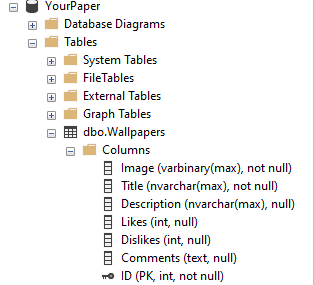

# YourPaper
An app where you can download free wallpapers.
## Database
The database looks like this:  

  

If you are using this app you will need to change the Conntection strings in browse.cs and upload.cs

## Home
The homepage loads the first 50 images of the database when started. It has a search box and upload button. The title bar is custom and not the deafult one. It is a borderless form.

## Upload
The upload page consists of a few boxes for details and a custom title bar.

## Splash
The splash screen opens for 3 seconds when the app is started. It actually has no purpose other than it looks cool. I will probably make it load the images so the home page loads instantly in the futer but for now its pointless.
